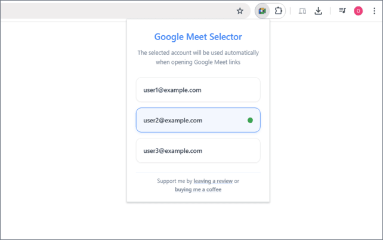

# Google Meet Selector

Chrome MV3 extension that redirects `meet.google.com` links to a chosen Google account via the `authuser` query param. The service worker owns account discovery and mismatch decisions; a Meet content script triggers redirects; the toolbar popup picks the default.

Published on the [Chrome Web Store](https://chromewebstore.google.com/detail/google-meet-selector/kgejkghcnljcmpfnncbggbpioinaekfo).

<p align="center">
  
</p>

## What's here

| Area | Path | Role |
| --- | --- | --- |
| Service worker | `extension/background.js` | Discover accounts (AccountChooser HTML, then `.google.com` cookies), sync to `chrome.storage`, 30-min alarm refresh, message API for default account + mismatch → redirect URL |
| Content script | `extension/scripts/content.js` | On Meet pages, ask the worker whether to redirect; re-check on history/title changes |
| Shared helpers | `extension/scripts/utils.js` | Email scrape + `authuser` parsing (loaded by worker via `importScripts`, and with the content script) |
| Popup | `extension/popup/` | List accounts, set default email, refresh / error UI |
| Manifest | `extension/manifest.json` | MV3 wiring: storage, cookies, tabs, alarms; host `https://*.google.com/*` |
| Packaging | `scripts/build-script.js` | Zip `extension/` → `build/extension.zip` |
| Release | `.release-it.json` | Version bump, format check, build, GitHub release with the zip |

Most of the logic is in `background.js` (discovery, validation, email-based default + legacy index migration, per-tab redirect guards). The content script is a thin client; the popup is the selection UI over the same message handlers.

## Layout

```
default-google-meet/
├── extension/                 # load this folder unpacked in Chrome
│   ├── manifest.json
│   ├── background.js          # service worker
│   ├── scripts/
│   │   ├── content.js         # Meet redirect trigger
│   │   └── utils.js
│   ├── popup/                 # toolbar UI
│   └── images/
├── docs/screenshot.png        # README screenshot
├── scripts/build-script.js    # npm run build
├── .release-it.json
├── package.json
└── AGENTS.md                  # agent-oriented build/style notes
```

## Setup

```bash
npm ci
```

Load unpacked: Chrome → `chrome://extensions` → Developer mode → Load unpacked → select `extension/`.

```bash
npm run build          # → build/extension.zip
npm run format:check
npm run release:dry    # optional
```

No automated tests; verify by opening a Meet link signed into a non-default account and confirming the `authuser` redirect.
